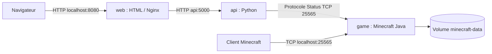

# TP Docker Cloud - Minecraft

Trois services : **HTML avec Nginx**, **API Python**, **Minecraft Java 1.21.11**.

## Demarrer

Prerequis : Docker Desktop demarre en mode Linux, Python 3.10 ou plus sur
l'ordinateur, Internet. Les images sont construites pour linux/amd64.
Dans un terminal PowerShell ouvert dans le dossier tp :

```powershell
python prepare.py
Copy-Item .env.example .env
```

Ne recopier .env que la premiere fois, pour conserver ensuite ses reglages.
Lire [l'EULA Minecraft](https://www.minecraft.net/en-us/eula) et, uniquement
si tu acceptes, mettre `EULA=true` dans `.env`. Sinon le jeu refuse de demarrer.

```powershell
docker compose up --build -d --remove-orphans
docker compose ps
docker compose logs -f game
```

Attendre le message `Done` du serveur. Ouvrir **http://localhost:8080**.
Dans Minecraft **Java Edition 1.21.11**, choisir Multijoueur, Connexion directe,
puis **localhost:25565**. L'authentification est active : un compte valide est
necessaire. L'API et la page peuvent fonctionner meme si le jeu est arrete.

`--remove-orphans` retire les anciens conteneurs de ce projet, si presents,
sans supprimer les volumes. La preparation telecharge environ 60 Mo ;
les installations de Python, Java et Nginx demandent aussi Internet.

## Architecture



Le reseau `cloud` permet aux services de se trouver avec leur nom DNS.
Seuls le site et Minecraft publient des ports sur l'ordinateur. Nginx transmet
`/api/status` a Python. L'API renvoie l'etat, la version et le nombre de joueurs
fournis par Minecraft. Si le jeu ne repond pas, elle retourne `online=false`.

## Choix des images et dependances

Les trois images partent de `scratch` et extraient un rootfs officiel Alpine
3.23.6. **Aucune image Docker Hub n'est utilisee**, meme pour la construction.
`prepare.py` telecharge le rootfs et le JAR officiel depuis Alpine et Mojang,
puis verifie les empreintes attendues : SHA256 pour Alpine, SHA1 fourni par
Mojang pour Minecraft. Les fichiers sont dans `.docker`, ignore par Git.

| Service | Paquets installes | Pourquoi | Port interne |
| --- | --- | --- | --- |
| web | nginx | Servir HTML et relayer les requetes API | 8080/TCP |
| api | python3 | API HTTP et interrogation de Minecraft | 5000/TCP |
| game | openjdk21-jre-headless, python3 | Java 21 execute Minecraft, Python configure le serveur et controle sa disponibilite | 25565/TCP |

`apk add --no-cache` installe les paquets et leurs dependances sans conserver
le cache. Les runtimes apportent leurs bibliotheques systeme : compression,
SSL, musl et modules Python notamment. Le code Python n'utilise aucun paquet
pip. Java headless n'a pas besoin d'interface graphique.
Les paquets Alpine peuvent evoluer : rootfs et JAR fixes ne garantissent pas
un build identique bit pour bit dans le temps.

## Operations sur le systeme et points d'entree

- `addgroup` et `adduser` creent le compte applicatif UID/GID 10001.
- `USER` lance les trois services sans privileges root.
- `WORKDIR` definit les repertoires de travail ; `COPY` ajoute le code.
- `COPY --chown` attribue les fichiers au compte applicatif.
- Le jeu cree `/data` et en donne la propriete a cet utilisateur pour sauvegarder.
- Nginx ecrit ses logs sur stdout/stderr, son PID et ses fichiers temporaires
  dans `/tmp`. Le port 8080 permet son execution sans privileges root.
- `PYTHONUNBUFFERED` affiche immediatement les logs ; `PYTHONDONTWRITEBYTECODE`
  evite la creation de fichiers pyc.

`ENTRYPOINT` utilise la forme exec : Nginx et l'API sont les processus principaux.
Nginx reste au premier plan avec `daemon off`. L'API traite SIGTERM et ferme
proprement son serveur HTTP. Pour Minecraft, `start.py` configure les fichiers
puis se remplace par Java avec `os.execvp` : Java recoit donc SIGTERM directement
et lance sa procedure d'arret et de sauvegarde. Compose lui laisse 60 secondes.
Nginx utilise SIGQUIT pour son arret progressif et gere aussi SIGTERM pour un
arret rapide ; l'API dispose de 10 secondes pour s'arreter.

## Parametres et ressources

| Parametre | Utilisation |
| --- | --- |
| EULA | Acceptation personnelle obligatoire avant lancement du jeu |
| SERVER_NAME | Nom affiche sur le site et MOTD Minecraft |
| GAME_PORT | Port du serveur, publication et cible de l'API |
| PUBLIC_GAME_ADDRESS | Adresse affichee au joueur |
| WEB_PORT | Port du site sur l'ordinateur |
| MAX_PLAYERS | Nombre maximal de joueurs |
| JAVA_XMS / JAVA_XMX | Tas Java initial et maximal |
| WEB/API/GAME_CPUS | Plafonds CPU de chaque service |
| WEB/API/GAME_MEMORY | Plafonds memoire de chaque service |

Ces valeurs figurent dans `.env.example` et sont transmises par Compose.
`PORT=5000` et `GAME_HOST=game` configurent aussi l'API dans Compose.
Si GAME_PORT change, adapter PUBLIC_GAME_ADDRESS et la connexion du client.

| Service | CPU max | Memoire max | Justification |
| --- | --- | --- | --- |
| web | 0.2 | 128 Mio | Page statique et petites requetes |
| api | 0.5 | 128 Mio | API legere, sans framework |
| game | 2 | 2 Gio | Petit serveur de TP avec tas Java de 1536 Mio |

Ce sont des plafonds, pas des reservations. `JAVA_XMX=1536M` reste inferieur
a la limite de 2 Gio pour laisser de la place aux allocations natives et
threads. Ajuster selon le monde et le nombre de joueurs avec `docker stats`.

## Demarrage et stockage

Le jeu et le site attendent que l'API soit saine. Cela permet de consulter
l'etat meme pendant le chargement de Minecraft. L'API utilise `/health`,
Nginx aussi. Le healthcheck du jeu interroge le protocole Status Minecraft,
avec 120 secondes de delai initial pour generer le monde. `depends_on` regle
le demarrage, pas une surveillance continue des dependances.

Le volume `minecraft-data` conserve monde, configuration, journaux et listes
de joueurs. Ne pas modifier un monde pendant que le serveur tourne.

```powershell
Invoke-RestMethod http://localhost:8080/api/status
docker compose logs
docker stats --no-stream
docker compose stop game
# Le site doit maintenant afficher un serveur arrete.
docker compose start game
# Attendre que le jeu soit sain, puis verifier le monde dans Minecraft.
docker compose down
```

`down` conserve le volume ; **`down -v` le supprime**. Pour verifier la
persistance, modifier le monde dans Minecraft, arreter proprement, recreer
le conteneur avec `docker compose up -d --force-recreate game`, puis rejoindre.

## Docker et machines virtuelles

Les conteneurs partagent le noyau de leur environnement d'execution ; une VM
possede son propre noyau et systeme complet. Docker facilite la reproduction
des services et Compose centralise ressources, reseau et dependances.
Sous Windows, Docker Desktop fournit un environnement Linux pour ces images.

## Rendu Git

Mettre ce dossier dans un depot Git et fournir son lien. `.docker` et `.env`
ne doivent pas etre publies ; les scripts et `.env.example` permettent de
reconstruire. Le README contient les explications et le schema demandes.
Ajouter des captures du site, des conteneurs et d'une connexion Minecraft.

## Mesures de ressources demandees

Les consignes demandent des benchmarks pour justifier les limites CPU et RAM.
Utiliser `docker stats` au repos puis avec un joueur connecte et noter les
valeurs observees. Ces mesures restent a consigner pour Minecraft apres
acceptation personnelle de l'EULA.

Sources : [Alpine officiel](https://dl-cdn.alpinelinux.org/alpine/v3.23/releases/x86_64/),
[serveur Minecraft officiel](https://www.minecraft.net/en-us/download/server).
